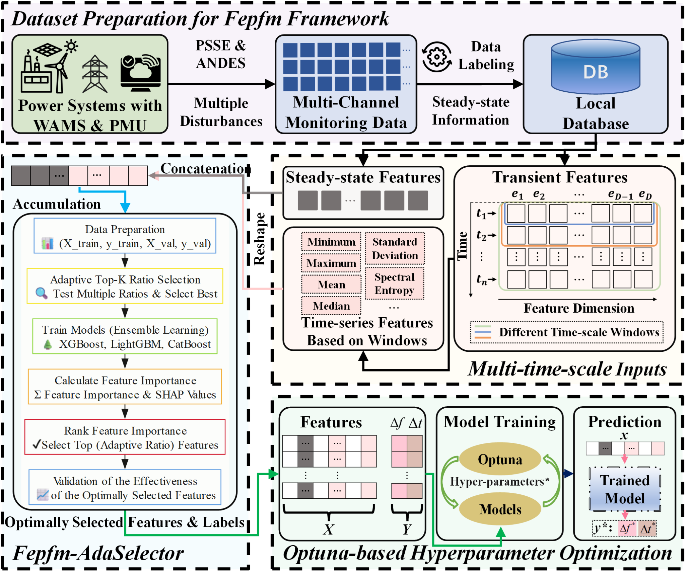

## 🚧 Still Under Construction - please open issues if you find any bugs or have suggestions, thank you!

[](https://github.com/hanxiao0607/AERCA/blob/main/LICENSE)

# Fepfm: A Post-Disturbance Frequency Extremes Prediction Framework for Power Systems Based on Trustworthy Machine Learning
<div align="center">
  
</div>

---

## 🗂️ Table of Contents

1. [Overview](#overview)
2. [System Configuration](#system-configuration)
3. [Installation](#installation)
4. [Usage](#usage)
    - [Cloning the Repository](#cloning-the-repository)
    - [Running the Code](#running-the-code)
    - [Command-Line Options](#command-line-options)
5. [Datasets](#datasets)
6. [Citation](#citation)
7. [Contact & Support](#contact--support)

---

## 📘 Overview

The Fepfm framework provides trustworthy machine learning for predicting post-disturbance frequency extremes (nadir/zenith) and their arrival times in modern power systems. Implemented in Python with support for sklearn and leading GBDT libraries, Fepfm enables high-accuracy, low-latency prediction across diverse grid scenarios by integrating:
- Automated large-scale dataset generation through PSS/E to address real-world data scarcity.
- An adaptive feature selection algorithm (Fepfm-AdaSelector) that fuses power system physical insights with multi-model SHAP analysis.
- Optuna-optimized LightGBM and CatBoost models for efficient hyperparameter tuning and superior generalization.
- A multi-scale temporal input strategy to capture transient and long-term frequency dynamics.

The framework has been validated on modified IEEE 39-bus and 300-bus systems, achieving over 95% accuracy (1–MAPE) with sub-millisecond inference latency, making it highly applicable to real-time dynamic security assessment in low-inertia, RES-rich power systems.

Our paper is in progress.

---

## 🧰 System Configuration

The code has been developed and tested using the following system setup:

- **Operating System:** Windows11 and Ubuntu 24.04
- **PSS/E Version:** 33.04
- **Python Version:** 3.12.7
- **Other package Version:** Please see requirements.txt

---

## ⚙️ Installation

### Prerequisites

1. **Install python:**

   ```bash
   Ensure that Python 3.12.7 is installed
    ```
   
2. **Install the required packages:**
    
    ```bash
    pip install -r requirements.txt
    ```

---

## 🚀 Usage
### Cloning the Repository
Clone the repository from GitHub and navigate into the project directory. Replace `my-project` with your preferred folder name:


     git clone https://github.com/Zong-my/Fepfm.git my-project
     cd my-project

### Running the Code
Execute the main script ./utils/main.py to try the Fepfm framework. You first need to construct your own dataset using Python and PSSE software. The co-usage methodology of Python and PSSE can be referred to at the following URL: https://github.com/Zong-my/psse3304_python_tutorial

---

## 📊 Datasets
You need to construct your own dataset using Python and PSSE software. The co-usage methodology of Python and PSSE can be referred to at the following URL: https://github.com/Zong-my/psse3304_python_tutorial.

---

## 📄 Citation
```
Our paper is in progress.
```

---

## 📬 Contact & Support
For any questions, issues, or contributions, please open an issue on GitHub or contact the repository maintainer.
